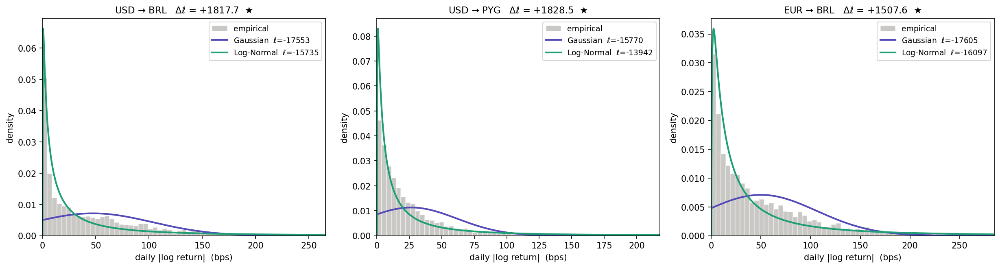
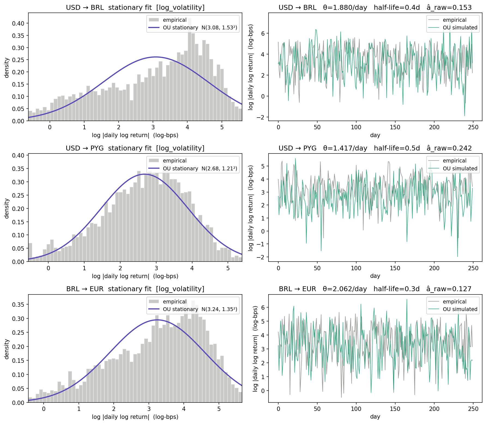
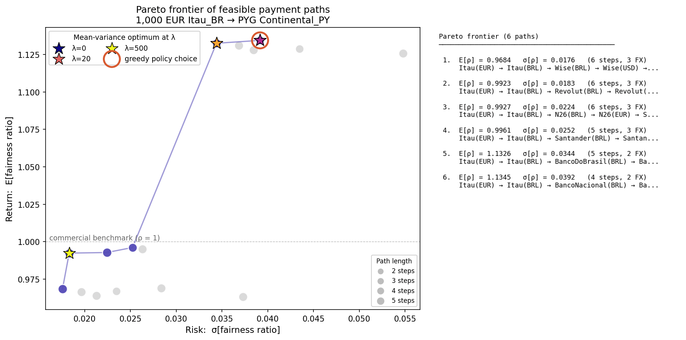
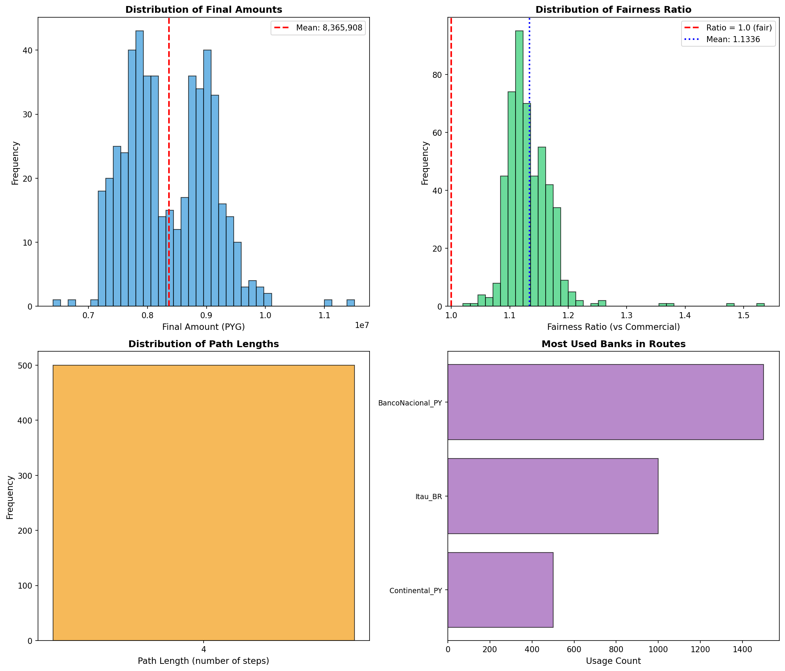
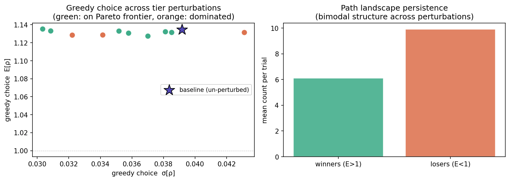

# RouteFair
### Probabilistic Routing for Cross-Border Payments — An EU-Mercosur Case Study

*CS109: Probability for Computer Scientists · Stanford University · June 2026*
*Marco Paes — marcorp@stanford.edu*

---

**[🌐 Interactive Website](https://markhetos.github.io/routefair)** · **[📄 Paper (PDF)](docs/paper.pdf)**

---

A "Google Maps for Money" built on maximum likelihood estimation, Ornstein–Uhlenbeck dynamics, and mean-variance portfolio optimization. Given a source bank, destination, and risk tolerance, the simulator finds the optimal multi-hop path through a 12-institution, 4-currency correspondent banking network — and proves statistically that it beats commercial exchange rates.

| Metric | Value |
|---|---|
| Improvement over commercial benchmark | **+13.4%** |
| 95% Confidence interval | [1.1299, 1.1374] |
| One-sided z-statistic | **Z = 69.7** |
| p-value | **< 10⁻¹⁰** |
| Paths on Pareto frontier | **6 / 16** |
| Risk-aversion crossovers | **λ\*₁ ≈ 11, λ\*₂ ≈ 331** |

---

## The Problem

Sending money across the EUR ↔ BRL ↔ PYG corridor silently destroys 10–15% of the transferred amount through opaque institutional FX markups compounded at every hop of the correspondent banking chain. The EU-Mercosur Interim Trade Agreement, in provisional application since May 1, 2026, links 780 million consumers across Europe and South America — and leaves this payment friction completely unaddressed.

---

## Four-Phase Model

### Phase 1 — Maximum Likelihood Distribution Fitting

Fits Gaussian and Log-Normal models to daily corridor volatility `|r_t|` by closed-form MLE. The key technical detail: the Jacobian term `−Σ log x_i` puts both log-likelihoods on the same measure, making the comparison exact.

**Result:** Log-Normal wins all 12 corridors with Δℓ ∈ [+784, +1829].



---

### Phase 2 — Ornstein–Uhlenbeck Log-Volatility Dynamics

Models `log|r_t|` as an OU process. The OU transition density reduces to an AR(1) model, yielding a **closed-form OLS estimator** — no numerical optimizer required.

**The bridge:** the OU stationary distribution `Y∞ ~ N(μ, σ²/2θ)` implies `|r| = exp(Y∞) ~ LogNormal(μ, σ²/2θ)` — exactly the Phase 1 distribution. Two phases, one coherent model.

```
dY_t = θ(μ − Y_t) dt + σ dW_t   →   Closed-form: θ̂ = −log(â)/Δt
```

**Result:** â ∈ [0.10, 0.24] across all corridors, half-lives 0.3–0.5 days.



---

### Phase 3 — Pareto Frontier and Mean-Variance Optimality

Enumerates all 16 feasible paths via DFS; evaluates each with 300 Monte Carlo runs; traces the Pareto frontier in (σ[ρ], E[ρ]) space.

**Mean-variance utility** (Pratt–Arrow Taylor expansion):

```
U_MV(X) = E[X] − (λ/2) · Var[X]
λ*_{i→j} = 2(E_i − E_j) / (σ_i² − σ_j²)
```

**Result:** greedy policy is the λ=0 Pareto optimum. Two analytically derived thresholds:
- **λ\*₁ ≈ 11** — switch to lower-σ BRL route (E barely changes)
- **λ\*₂ ≈ 331** — abandon BRL corridor for European low-variance route



---

### Phase 4 — CLT-Based Statistical Inference

500 i.i.d. Monte Carlo realizations; CLT-based 95% CI; one-sample Wald z-test.

```
H₀: E[ρ] = 1   vs   H₁: E[ρ] > 1
Z = (ρ̄ − 1) / (σ̂_ρ / √n) = 69.69    p < 10⁻¹⁰
```

**Result:** overwhelming rejection of H₀. The 13.4% improvement is structural, not noise.



---

### Sensitivity Analysis

Tier multipliers perturbed by Uniform[0.8, 1.2] across 10 trials.

- Greedy on Pareto frontier: **7/10 trials**
- E[ρ] range: **[1.127, 1.135]** — above 12.7% improvement in every trial
- Bimodal path landscape persists: **10/10 trials**



---

## Setup

```bash
git clone https://github.com/Markhetos/routefair
cd routefair
pip install numpy pandas matplotlib networkx
```

---

## Usage

```bash
# Run the full simulator (fits MLE + OU on first run, cached thereafter)
python routing_sim_v2.py

# Enter a directive when prompted, e.g.:
#   Source bank: Itau_BR   Currency: EUR
#   Dest bank: Continental_PY   Currency: PYG
#   Amount: 1000

# Output figures go to: graphs/{source}_{cur}-{dest}_{cur}/
```

**Run the test suite:**

```bash
python test_mle.py        # Phase 1: 4 tests
python test_ou.py         # Phase 2: 5 tests
python test-frontier.py   # Phase 3: 4 tests
python test_clt.py        # Phase 4: 3 tests
```

---

## Project Structure

```
routefair/
├── routing_sim_v2.py          # Main simulator + all phases integrated
├── mle_estimation.py          # Phase 1: Gaussian & Log-Normal MLE
├── ou_process.py              # Phase 2: OU process, AR(1) OLS estimator
├── efficient_frontier.py      # Phase 3: Pareto frontier, mean-variance
├── clt_analysis.py            # Phase 4: CLT confidence intervals, z-test
├── sensitivity_analysis.py    # Robustness to structural priors
├── sim_utils.py               # Caching + per-run output folders
├── data/
│   └── fx_changes.csv         # ~3,200 trading days of FX data (4 currencies)
├── graphs/                    # Per-directive output figures
│   └── Itau_BR_EUR-Continental_PY_PYG/
│       ├── efficient_frontier.png
│       ├── stats_distributions.png
│       └── sensitivity_analysis.png
├── docs/                      # Paper (PDF)
│   └── index.html             # Interactive website
└── test_*.py                  # Test suites for each phase
```

---

## Key References

- M. K. Kochenderfer, T. A. Wheeler, K. H. Wray — *Algorithms for Decision Making*, MIT Press, 2022
- J. C. Pratt — "Risk Aversion in the Small and in the Large", *Econometrica* 32(1), 1964
- European Commission — "EU-Mercosur ITA Starts to Provisionally Apply", April 2026

---

## Acknowledgments

The institution-currency network and greedy lookahead infrastructure were developed as part of prior coursework in sequential decision-making. All probability-specific contributions — MLE estimators, OU dynamics, mean-variance Pareto frontier, and CLT inference — are original to this project.